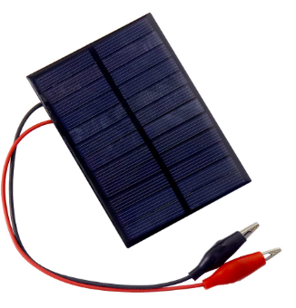

#### Solar Panel

*A solar panel is a device that converts sunlight into electricity by using photovoltaic cells. PV cells are made of materials that produce excited electrons when exposed to light*

